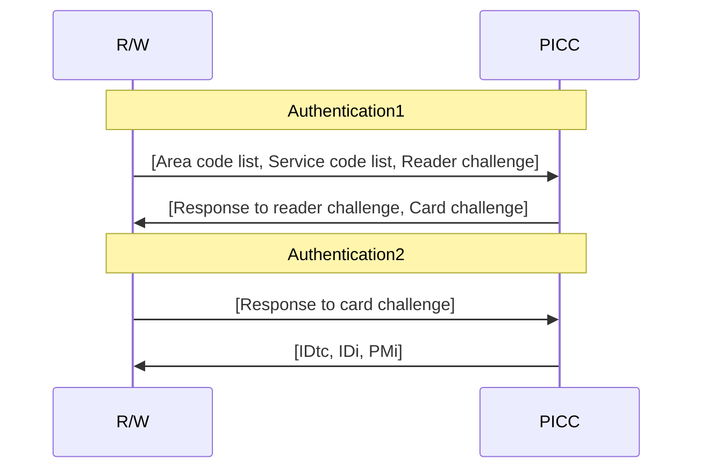

## Mutual Authentication
### DES
#### Procedure

#### Group Service Key & User Service Key
> TODO: actually confirm definition of Group Service Key and User Service Key

Mentioned in Security Target documents[@sonyRCSA00SecurityTarget2012] and referred to as the "Area Intermediate Key" and "Service Intermediate Key" respectively in patent filings[@sonyFeliCaMutualAuthenticationPatent2008]. This keypair is used as access keys and as intermediates in diversified key generation when authenticating to a FeliCa IC.

A keypair is used in conjunction with a fixed set of area codes (group service) and service codes (user service) respectively.

A GSK is composed of the System Key, the Area 0000 key, and all the keys of the specified subareas, and relates to a corresponding Area Code List. As generating a GSK requires the PICC's System Key as an initialisation vector, this means the issuer is the root of trust. The GSK is generated by continually encrypting with DES using each specified area's key as the encryption key.

GSKs can be appended to, which is useful if an area owner wants to provide authenticated capabilities to the owners of a sub area. However, the appended area(s) must be a direct subarea of one of the prior areas. Suppose the owner of subareas 1100 and 2100 wishes to generate their own GSK and they receive a GSK from the owner of Area 1000, which already corresponds to the System, Area 0000, and Area 1000. The owner can only append the key for Area 1100, as appending Area 2100 would be invalid(?).

Upon the creation of a GSK, the USK can be created. The USK is composed of the GSK, and all the keys of the specified services, and relates to a corresponding Service Code List. As the USK uses the GSK as an initialisation vector, its GSK is then immutable and cannot be appended to without creating a new related USK. The USK is generated by continually encrypting with DES using each corresponding service's key as the encryption key.

Similar to GSKs, USKs can be appended to, which is useful if the owner of a service wants to provide authenticated capabilities on their service to other users. However, the appended service(s) must be belong to one of the areas specified in its corresponding GSK.

These keys are a precursor to the 3DES keys used in mutual authentication[@sonyFeliCaMutualAuthenticationPatent2008]:

$$
\begin{aligned}
K_{bc} &= IDm \oplus K_{gs} \\
K_{ac} &= \text{DESEnc}_{IDm}(K_{us}) \\
K_b  &= K_{ac}||K_{bc} \\
K_a  &= K_{bc}||\text{DESEnc}_{K_{ac}}(K_{bc})
\end{aligned}
$$

Following mutual authentication, the reader-generated R~a~ is the initial transaction ID, whereas the card-generated R~b~ is the shared DES transaction key[@sonyEncryptedTransportPatent2002;@sonyProtocolNegotiationPatent2008].

## AES
### Group Key
Of unknown structure; mentioned in several public Security Target documents, and one with DES out-of-scope does not reference a manual for generating GSKs or USKs[@sonyFeliCaSD2SecurityTarget2020], meaning that this pertains to only the AES authentication.

It is unknown if and how access control is implemented across managers/issuers, and whether it is constructed similar to GSKs and USKs.

A Group Key may be a merger of both GSK and USK, into one key and corresponding list of areas and services.

## PIN code[@sonyFeliCaPINCodePatent2011]

> Deprecated?

Mentioned in patents but not public documentation.
A separate service (*not* an overlay service) that doesn't handle data, but reads in PIN access attempts such that the user can write input attempts to the PIN code service(?) and then be authenticated to the corresponding service/area.

A PIN service code is the corresponding area/service code (*not* number(?)) with the 5th bit (0x20) set.